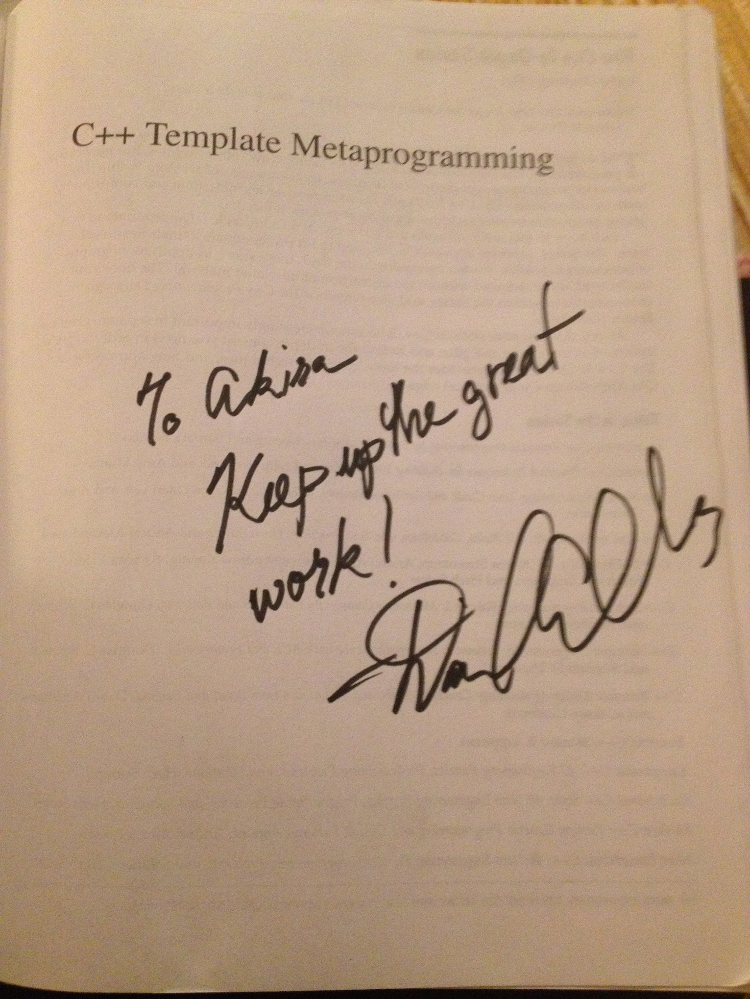

#C++テンプレートテクニック 初版

- 書名 : 『C++テンプレートテクニック - 簡潔で再利用しやすいコードのためのC++活用術』
- 著者 : επιστημη、高橋 晶
- 編集 : 白川 潤一
- 出版社 : ソフトバンククリエイティブ
- ページ数 : 352
- ISBN-10 : 4797354534
- ISBN-13 : 978-4797354539
- 発売日： 2009年4月25日
- [正誤情報はこちら](http://www.sbcr.jp/support/8672.html)

##購入先
- [Amazon.co.jp](http://www.amazon.co.jp/dp/4797354534/ref=as_sl_pc_tf_lc?tag=faithandbrave-22&camp=243&creative=1615&linkCode=as1&creativeASIN=4797354534&adid=1HZB8Y5VN0EJWVQ2J9X0&&ref-refURL=http%3A%2F%2Ffaithandbrave.hateblo.jp%2Fentry%2F20090408%2F1239205628)
- [SBクリエイティブ](http://www.sbcr.jp/products/4797354539.html)

##書籍概要
本書は、プログラミング言語C++の特徴的な機能である「テンプレート」を使用した、さまざまな技法を紹介しています。
テンプレートは、プログラムコードを再利用するための機能です。しかし実際にテンプレートを使用すると、様々な問題が発生します。本書が紹介する技法は、テンプレートが持つ再利用の力を最大限に引き出すためのもので、どれもが多くの場面で役に立ちます。

##執筆期間
執筆期間は、私が参加したネタ出しと章立て、および執筆とレビューが完了したあとの校正も含めて、約1年間でした。

##コンセプト
- C++入門書に記載されているテンプレートの解説と、難しいと言われているテンプレート技法の書籍『Modern C++ Design』の中間になる本を出そう。
- 執筆当時は、C++テンプレートの有名な書籍である『C++ Templates: The Complete Guide』や『C++ Template Metaprogramming』がまだ日本語訳されていなかったので、そのあたりもカバーしよう。

##本書執筆の経緯
ある日、私のもとに、επιστημη(えぴすてーめー)さんから一本のメールが来ました。

エピ：「いま、テンプレートの本を書こうとしてるんだけど、なんかネタない？」
私： 「思いつく限りのネタを列挙してみました。(テンプレートメタプログラミング、SFINAE、テンプレート型変換演算子、ポリシーに基づく設計など)」
エピ： 「じゃあ、書いて♪」

こういった経緯から、書籍の執筆に関われるチャンスだと思い、執筆に参加させていただくことになりました。
エピさんとは、わんくま同盟の東京勉強会で知り合いました。このとき声を掛けていただいたのは、私がわんくま同盟の勉強会で、C++0xコンセプトの発表をしたからだったと思います。

##書かなかったこと
当時知っていながら書かなかった技法がいくつかあります。
まず、型リスト。『Modern C++ Design』でも大きく取り上げられ、実際に有用な技法でした。しかし、C++03でBoost.MPLのような優れた型リストを実装するのは困難がともなうのと、当時C++0xに可変引数テンプレートが導入予定だということがわかっていたこともあり、本書初版では紹介しませんでした。
型リストは、第2版でC++11に対応する際、改めて紹介を書きました。

(あと1〜2個あったと思うので、思い出したら書く)

##執筆の思い出
当時の私は、ブログで公開文章を書いてはいましたが、それほどうまく日本語を扱えていたわけではありませんでした。雑誌のような企業が管理する媒体での記事執筆もしていませんでした。私がブログで書く文章は「ひとつの記事が、1〜2分程度で簡潔に読めるように」を心がけていたこともあって、あまり詳細な説明も書いてきませんでした。そのため、書籍というターゲット環境向けに文章を書くのに、少し戸惑いました。編集さんにもそう説明した上で、試しにひとつの章を書いて、それを編集さんに見てもらうことにしました。それを見てもらって編集さんに言われたのが「説明は、書きすぎるということはないから、もっと書いてほしい」ということでした。これはその後に文章を書くときにも、よく思い出す言葉です。本書初版は、私のこれまでの癖もあって、簡潔な説明が多く残っています。それに対して「説明がさらっとしていて読みやすい」という好意的な感想も多くいただきました。しかしやはり、とくに書籍という媒体では、しっかりとした説明が必要だと考えてその後文章を書いてきたので、今ではもう、あのときのような簡潔な文章は無意識には書けなくなっています。

本書の執筆において、ひと通りの内容を書ききった段階から、何人かのC++エキスパートにレビューをしていただくことにしました。レビュアー集めは、私とエピさんが声をかけました。そのときに集まったメンバー主に、わんくま同盟コミュニティのつながりでした。それに加えて、C++標準化委員会で知り合った[uskzさん][uskz]と[近藤さん][redboltz]にも参加していただけました。編集さんにもお願いすればレビュアーを探してきてもらえるのですが、私たち著者のつながりでレビュアー集めをしました。信頼できる方々とのつながりがあったのは幸いでした。

レビューには、プログラマにはおなじみのバグ管理システムTracを使用しました。これは、[近藤さん][redboltz]がシステムを用意してくれました。
書籍という媒体で文章を書いたことがないのはやはり大きかったです。[めるぽん][melpon]と[近藤さん][redboltz]から、「動機が弱い」という問題が報告されるたびに、頭を抱えていたのを覚えています。そのたびに、紹介している技法を調べ直し、動機やユースケースを収集し、文章をまとめ直したりしていました。彼らが発売前に指摘してくれなかったら、本書は「何に役立つのかわからない」「こんなのはただの遊びだ、実用的じゃない」というような評価が大半になっていたことでしょう。

第11章で書いた「Extension Member Function」というのは、C#の言語機能である「拡張メソッド(Extension Method)」をC++で実現しよう、というもので、私が名前を付けたものです。これは、PStade.OvenやBoost.Rangeが採用しているパイプ演算子(`operator|()`)を、Rangeアダプタとして使用するだけでなく、メンバ関数の後付けとして汎用的な技法にしよう、と思い立って書いた章になります。
この章のために、いくつかのRangeアダプタの実装を紹介用に書いて、それをもとに文章にまとめました。それに対して[uskzさん][uskz]から、「この実装では遅延評価が考慮されていない。PStade.OvenとBoost.Rangeは、イテレータによって処理を遅延させていて、Rangeアダプタがその場で処理を実行するわけではない」という指摘が行われました。私は、Rangeアダプタの技術を正しく理解しない状態で、執筆を進めていたのでした。[uskzさん][uskz]に多大な感謝をしつつ、Rangeアダプタの概念と実装を調べ直し、この章をまるまる書き直すことになりました。
あのときは自分の不甲斐なさにだいぶ落ち込んだものでしたが、これもまた、発売前のレビューが重要だと思えた出来事でした。

文章中の載せるコードは、自分でサンプルコードを書いて、Wordの原稿データに貼り付け、元のサンプルコードを破棄していました。そのようにしていたため、レビュー段階になって、複数コンパイラでの検証が難しくなりました。あのときは、[あんどちんさん][andochin]が原稿データからサンプルコードを手作業で抽出して、検証を進めてくれました。そのことがあってからは、使用したサンプルコードは、しっかりとっておくようにしました。

[uskz]: https://github.com/uskz
[redboltz]: https://github.com/redboltz
[melpon]: https://github.com/melpon
[andochin]: https://github.com/andochin

##執筆ツール
- 原稿執筆 : (私は)Microsoft Word
- 連絡 : メール
- レビュー : バグ管理システム[Trac](http://trac.edgewall.org/)
- 校正データ(PDF)のストレージ : Microsoft SkyDrive

##振り返り
私にとって初の書籍執筆だったこともあり、執筆のツールとして、よく考えずにMicrosoft Wordを使っていました。
あとになって振り返ると、ツールの選択は失敗でした。Wordには校正機能がついているため、些細な日本語の間違いは指摘してくれます。しかし、プログラムコードが多く出てくる書籍ではやはり、リッチテキストエディタよりも、プレーンテキストエディタの方が何かと都合がいいです。プレーンテキストの方はたとえば、バージョン管理システムとの相性がいいので、レビューの管理もしやすくなります。

レビューのツールとしてTracを使用したのは、成功でした。
レビュアーが指摘し、著者とともに修正内容を検討し、編集さんがPDFに反映させ、確認がとれたらチケットを閉じる、という一連の流れがよどみなく動いていました。

##執筆後の思い出
私が[近藤さん][redboltz]さんとC++Now! 2012に参加したとき、書籍『C++ Templates: The Complete Guide』の著者である[Daveed Vandevoordeさん](http://www.vandevoorde.com/Daveed/)がキーノートの発表者として来ていました。そのとき、私たちの『C++テンプレートテクニック』をDaveedさんにプレゼントしました。『C++ Templates』はすばらしい書籍でした。その著者の方をお会いでき、さらに自分が書いた本を受け取っていただけて、非常にうれしかったです。
私が持参した『C++ Templates』に、サインもいただけました。

また、そのときのC++Now!では、書籍『C++ Template Metaprogramming』の著者である[Dave Abrahamsさん](http://daveabrahams.com/)にもお会いできました。じつはそのときは、彼に用事があったからC++Now!に行ったのでした(『プログラミングの魔導書 Vol.2』で彼にインタビューをしたので、その関係です)。
Daveにも、私が持参した『C++ Template Metaprogramming』に、サインをいただけました。

C++テンプレートに関する偉大な名著を書かれたこのお二人に会えて、サインをもらえて感謝感激です。

##関連ページ
- [『C++テンプレートテクニック』もうすぐ発売です。 - Faith and Brave - C++で遊ぼう](http://faithandbrave.hateblo.jp/entry/20090408/1239205628)
- [C++Now2012体験記 - redboltzの日記](http://d.hatena.ne.jp/redboltz/20120519/1337385881)

