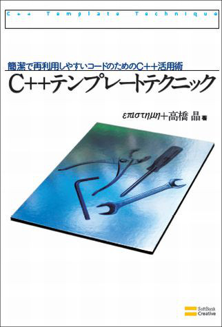

#C++テンプレートテクニック 初版

- 書名 : 『C++テンプレートテクニック - 簡潔で再利用しやすいコードのためのC++活用術』
- 著者 : επιστημη、高橋 晶
- 出版社 : ソフトバンククリエイティブ
- ページ数 : 352
- ISBN-10 : 4797354534
- ISBN-13 : 978-4797354539
- 発売日： 2009年4月25日
- [正誤情報はこちら](http://www.sbcr.jp/support/8672.html)

##購入先
- [Amazon.co.jp](http://www.amazon.co.jp/dp/4797354534/ref=as_sl_pc_tf_lc?tag=faithandbrave-22&camp=243&creative=1615&linkCode=as1&creativeASIN=4797354534&adid=1HZB8Y5VN0EJWVQ2J9X0&&ref-refURL=http%3A%2F%2Ffaithandbrave.hateblo.jp%2Fentry%2F20090408%2F1239205628)
- [SBクリエイティブ](http://www.sbcr.jp/products/4797354539.html)

##書籍概要
本書は、プログラミング言語C++の特徴的な機能である「テンプレート」を使用した、さまざまな技法を紹介しています。
テンプレートは、プログラムコードを再利用するための機能です。しかし実際にテンプレートを使用すると、様々な問題が発生します。本書が紹介する技法は、テンプレートが持つ再利用の力を最大限に引き出すためのもので、どれもが多くの場面で役に立ちます。

##執筆期間
執筆期間は、私が参加したネタ出しと章立て、および執筆とレビューが完了したあとの校正も含めて、約1年間でした。

##コンセプト
- C++入門書に記載されているテンプレートの解説と、難しいと言われているテンプレート技法の書籍『Modern C++ Design』の中間になる本を出そう。
- 執筆当時は、C++テンプレートの有名な書籍である『C++ Templates: The Complete Guide』や『C++ Template Metaprogramming』がまだ日本語訳されていなかったので、そのあたりもカバーしよう。

##本書執筆の経緯
ある日、私のもとに、επιστημη(えぴすてーめー)さんから一本のメールが来ました。

えぴ：「いま、テンプレートの本を書こうとしてるんだけど、なんかネタない？」
私： 「思いつく限りのネタを列挙してみました。(テンプレートメタプログラミング、SFINAE、テンプレート型変換演算子、ポリシーに基づく設計など)」
えぴ： 「じゃあ、書いて♪」

こういった経緯から、書籍の執筆に関われるチャンスだと思い、執筆に参加させていただくことになりました。

##執筆の思い出
(now writing...)

##関連ページ
- [「『C++テンプレートテクニック』もうすぐ発売です。 - Faith and Brave - C++で遊ぼう」](http://faithandbrave.hateblo.jp/entry/20090408/1239205628)

