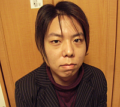

#高橋 晶 (Akira Takahashi)

[English version](./profile/en.md)

高橋 晶(Akira Takahashi)
1985年3月1日生まれ。
宮城県登米市出身、神奈川県横浜市在住。

##所属
- [株式会社ロングゲート](http://longgate.co.jp/) 取締役
- [boostjpコミュニティ](http://boostjp.github.io/) コアメンバ
- [cpprefjpコミュニティ](http://cpprefjp.github.io/) コアメンバ
- [P-Stade C++ Libraries](http://p-stade.sourceforge.net/) 現マネージャ
- [Boost Geometry Library](http://www.boost.org/libs/geometry/doc/html/index.html) コントリビュータ
- [Boost.勉強会](http://boostjp.github.io/study_meeting.html) 主催者

##ブログ
- [Faith and Brave - C++で遊ぼう](http://faithandbrave.hateblo.jp/)
- [信念と勇気、その先へ](http://faithandbrave.blogspot.com/)

##GitHubリポジトリ
- <https://github.com/faithandbrave>

##連絡先
- 個人メールアドレス : faithandbrave@gmail.com
- 会社メールアドレス : faithandbrave@longgate.co.jp
- Twitter : [@cpp_akira](https://twitter.com/cpp_akira)

##主に使用している言語
C++, C#, Objective-C++, Ruby, PHP。
Scala、Haskellなどもある程度使える。

##使用している技術・分野
メタプログラミング、オブジェクト指向プログラミング、関数型プログラミング、ジェネリックプログラミング、マルチパラダイムデザイン、EDSL、ドメイン駆動開発、ゲームプログラミング、ネットワークプログラミング、並列処理、構文解析、画像処理、テスト可能な設計、構文解析、非同期処理、コルーチンなど。

##使用しているマネジメント技術
アジャイル、Unified Process。

##最近の技術的な関心(2013/10/16現在)
並列処理の抽象化、GPGPU、Functional Reactive Programming、分散処理、グラフ理論、画像認識、統計。

##勉強会参加情報
- [ATND](http://atnd.org/users/3333)
- [PARTAKE](http://partake.in/users/05d895a6-5ca5-4777-b38f-c8a5a8c699d9)

##その他利用サービス
- [Facebook](http://www.facebook.com/faithandbrave)
- [Google+](https://plus.google.com/114861732104629916415/about)
- [ブクログ](http://booklog.jp/users/faithandbrave)
- [Amazon wish list](http://www.amazon.co.jp/registry/wishlist/1FUDGIO7C0HW/ref=cm_wl_rlist_go_o_C-1_d)

##写真

わんくま同盟 東京勉強会 #22 「C++0x 言語の未来を語る」にて。

Developers Summit 2010 「C++0x、Ruby、ECMAScript5 言語の国際標準化について」にて。

Boost.勉強会 #6 札幌にて。

GREE Tech Talk #05にて。

