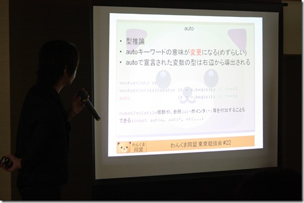
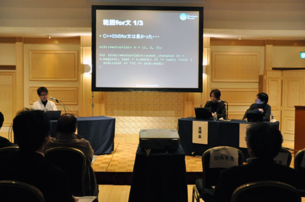

# Akira Takahashi

[Japanese version (日本語バージョン)](./profile.html)

Akira Takahashi
Born March 1, 1985 Miyagi-ken. Japan

## Affiliations
- [Preferred Networks, Inc.](https://www.preferred-networks.jp/) engineer
- [boostjp community](http://boostjp.github.io/) core member
- [cpprefjp community](http://cpprefjp.github.io/) core member
- [P-Stade C++ Libraries](http://p-stade.sourceforge.net/) manager
- [Boost Geometry Library](http://www.boost.org/libs/geometry/doc/html/index.html) contributor
- [Boost.StudyMeeting](http://boostjp.github.io/study_meeting.html) organizer
- [C++ MIX](https://cppmix.connpass.com/) organizer

## Blogs
- [Faith and Brave - C++で遊ぼう](http://faithandbrave.hateblo.jp/)
- [信念と勇気、その先へ](http://faithandbrave.blogspot.com/)

## GitHub Repository
- <https://github.com/faithandbrave>

## Contact
- Personal mail address : faithandbrave@gmail.com
- My Company mail address : akirat@preferred.jp
- Twitter : [@cpp_akira](https://twitter.com/cpp_akira)

## Skill in Programming Language
C++, Python, Elixir, Ruby, Haskell, Scala, C#, Objective-C++, PHP.

## Use Web Servies
- [Facebook](http://www.facebook.com/faithandbrave)
- [Google+](https://plus.google.com/114861732104629916415/about)
- [Booklog](http://booklog.jp/users/faithandbrave)

## Pictures

Wankuma Study Meeting in Tokyo #22 - "C++0x - Talking about the future of the language"

Developers Summit 2010 "C++0x, Ruby, ECMAScript5 About International Standardization"

Boost.StudyMeeting #6 in Sapporo

GREE Tech Talk #05

